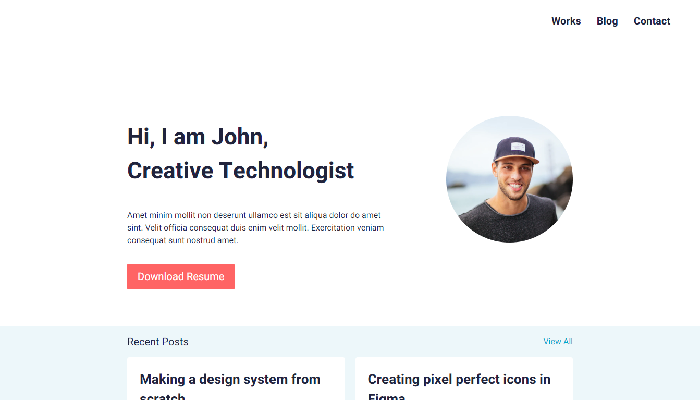
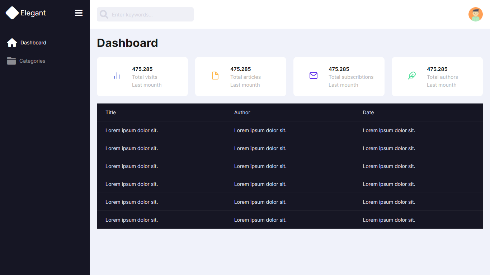
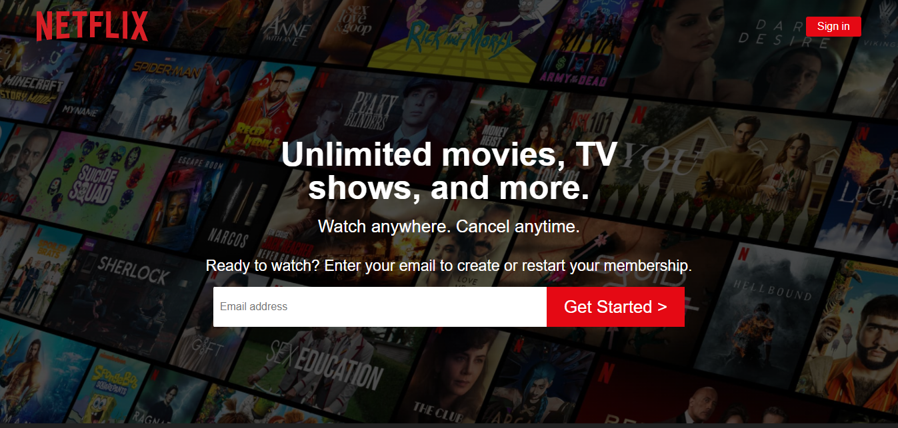
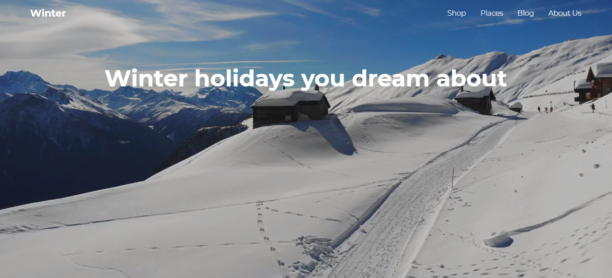
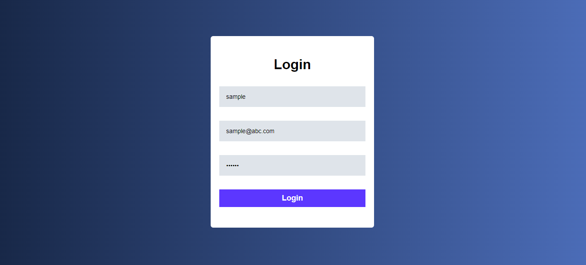

# HTML-CSS PROJECTS

HTML and CSS projects for web developers.

## Content

* [Responsive Personal Portfolio](#portfolio)
* [Responsive Dashboard](#dashboard)
* [Responsive Netflix Landing Page](#netflix)
* [Video Background](#video-background)
* [Login Page](#login-page)

 

### Responsive Personal Portfolio - [Back to top](#content)

 

### Responsive Dashboard - [Back to top](#content)

 

### Responsive Netflix Landing Page - [Back to top](#content)

 

### Video Background - [Back to top](#content)

 

### Login Page - [Back to top](#content)

 

